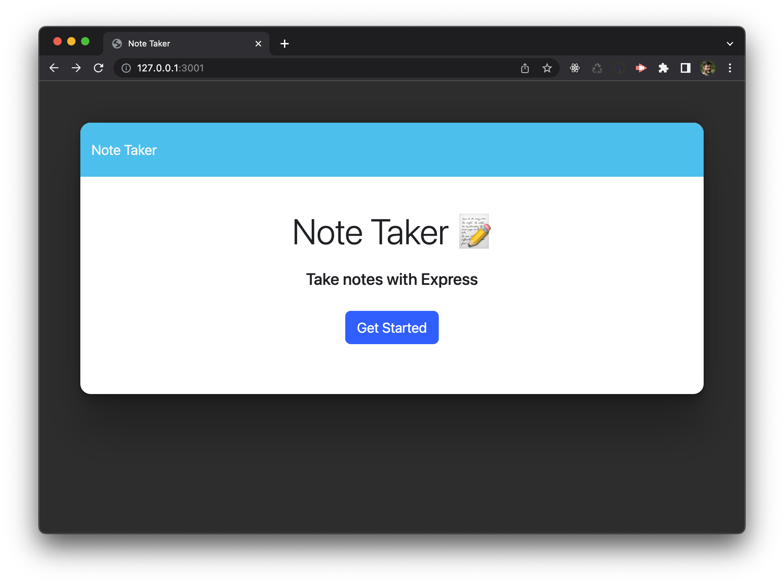
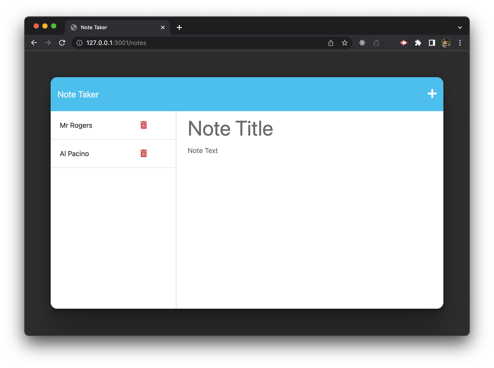

# Express Note Taker
## Description
This is an application called Note Taker that can be used to write and save notes. This application uses Express.js back end and will save and retrieve note data from a JSON file.
## Installation
N/A
## Usage
If you want to see the deployed application, visit this link: 
If you want to run it locally, follow this steps. You can clone this repo locally then follow the steps below:
1. Run this command to install dependencies
```bash
npm install
```
2. Run the following command in your terminal to start the application
```bash
node server.js
```
## What it should look like
### Intro screen


### Main screen

## Credits
N/A
## License
MIT license - Please refer to the LICENSE in the repo for more info.